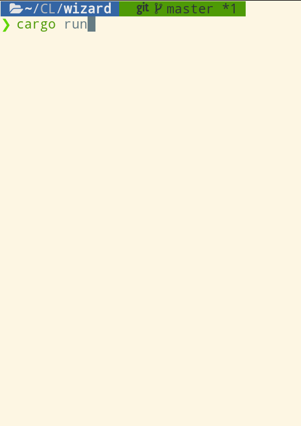

<pre>
          _                  _ 
         (_)                | |
__      ___ ______ _ _ __ __| |
\ \ /\ / / |_  / _` | '__/ _` |
 \ V  V /| |/ / (_| | | | (_| |
  \_/\_/ |_/___\__,_|_|  \__,_|
</pre>

Wizard is my favourite card game because you can win even when dealt bad cards - just like in life. 

The goal of this project is for me to learn Rust lang. Wizard is a small, achievable goal. 

### Demo: 
 - Terminal based 1 player game. &#x2705;
   
    

